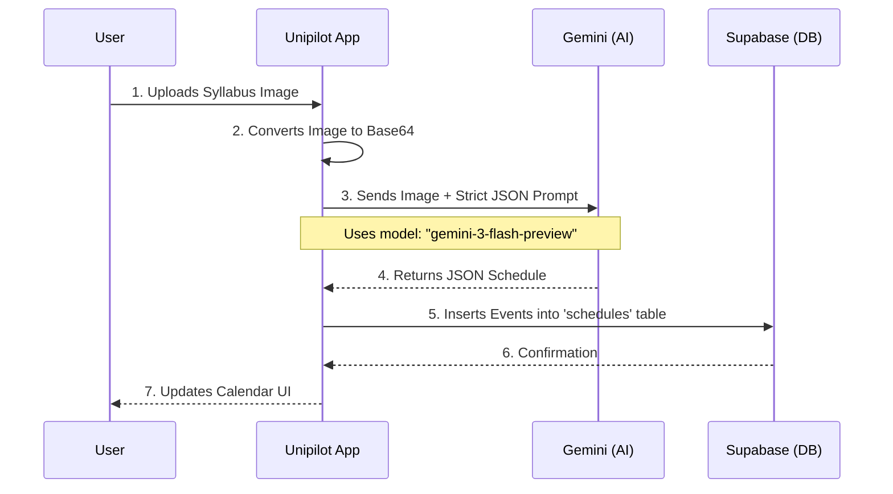

# System Architecture Diagrams 📐

## 1. Syllabus Parsing Flow (Sequence)

How a syllabus image turns into a schedule.



## 2. Authentication & Data Security

How we ensure data belongs to the right user.

```mermaid
graph TD
    A[User Opens App] --> B{Has Session?}
    B -- Yes --> C[Redirect to /index (Home)]
    B -- No --> D[Redirect to /(auth)/sign-in]

    D --> E[Login with Email/Pass]
    E --> F[Supabase Auth]
    F -- Token --> A

    C --> G[Fetch Schedule]
    G --> H{RLS Policy Check}
    H -- "auth.uid() == user_id" --> I[Return Data]
    H -- "Mismatch" --> J[Access Denied]
```
