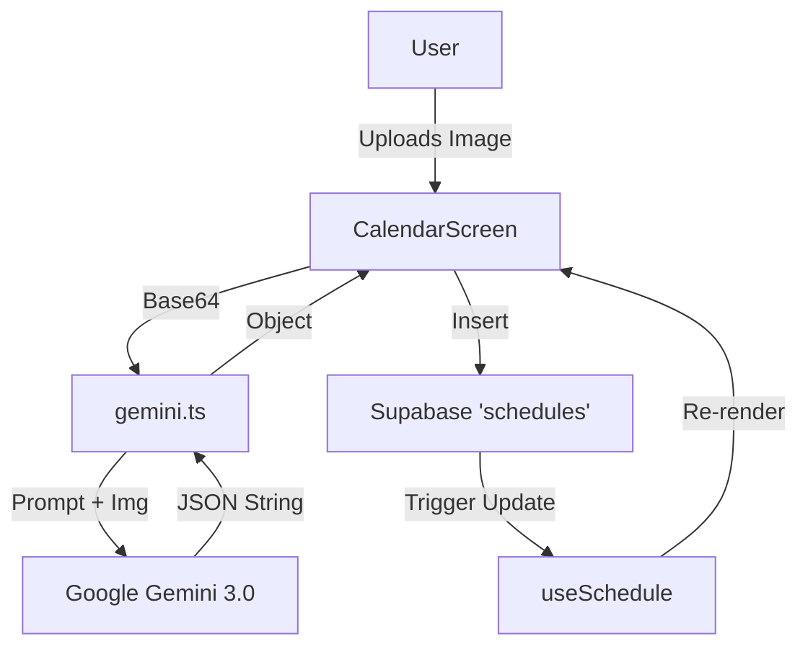

# Drift Context Scan & Technical Debt Analysis 📉

**Status:** Completed
**Date:** 2026-02-01

This document maps the implementation reality vs. the ideal state, identifying specific "Technical Debt" risks.

## 1. System Plumbing Map 🔧

### A. Authentication Flow

- **Source:** `src/contexts/AuthProvider.tsx`
- **State:** React Context (`session`, `user`, `isLoading`)
- **Persistence:** `AsyncStorage` (via `supabase.auth`)
- **Protection:** `app/_layout.tsx` -> Checks `session` -> Redirects via `router.replace`
- **Fragility Score:** 🟢 **Low**
  - _Why?_ Standard Supabase pattern. Redirect logic covers edge cases (loading loops).

### B. Smart Calendar Data Flow

- **Source:** `src/features/calendar/useSchedule.ts`
- **Fetch:** `supabase.from('schedules').select('*')`
- **State:** `useState<ScheduleItem[]>`
- **UI:** `CalendarScreen.tsx` -> `FlatList` -> `MotiView`
- **Fragility Score:** 🟡 **Medium**
  - _Risk 1:_ **Sort Order**: `.order('start_time')` uses alpha-sort on "HH:MM".
    - _Breakage Scenario:_ Fails for classes crossing midnight (e.g., 23:00 vs 01:00).
  - _Risk 2:_ **Error Silencing**: `useSchedule` console.logs errors but doesn't return `error` state to UI.

### C. Gemini Syllabus Parser (The "Black Box")

- **Input:** `CalendarScreen` (ImagePicker Base64)
- **Transport:** `src/services/gemini.ts` -> Google API (REST)
- **Output:** `JSON.parse(text)`
- **Fragility Score:** 🔴 **High**
  - _Risk 1:_ **Regex Brittle**: `.replace(/```json/g, '')` assumes Gemini _always_ uses code blocks. If it returns plain text, it's fine. If it adds conversational text ("Here is your JSON"), `JSON.parse` **crashes the app**.
  - _Risk 2:_ **Type Safety**: `CalendarScreen.tsx` uses `(e: any)` to map results.
    - _Breakage Scenario:_ If Gemini returns `startTime` (camelCase) instead of `start_time` (snake_case), the DB insert fails silently or with a SQL error.

---

## 2. Technical Debt Registry 💸

Areas where the code "works for now" but limits future growth.

| Debt Item                     | Risk Level | Description                                                                    | Fix                                              |
| :---------------------------- | :--------- | :----------------------------------------------------------------------------- | :----------------------------------------------- |
| **Logic: Time as Text**       | 🟡 Medium  | `start_time` is `TEXT` ("14:30"). Cannot calculate duration or overlap easily. | Migration to `TIMESTAMPTZ` and `date-fns` logic. |
| **Security: RLS Policies**    | 🟡 Medium  | RLS is active but policies need audit for "Shared Calendars" (Future V2).      | Strict "Select Own Data" audit.                  |
| **Stability: Gemini Parsing** | 🔴 High    | `JSON.parse` is un-guarded against malformed AI responses.                     | Add Zod schema validation for runtime safety.    |
| **Typing: `any` Usage**       | 🟡 Medium  | `CalendarScreen` uses `any` for `events` map.                                  | Define shared `GyminiResponse` interface.        |

---

## 3. Data Plumbing Diagram



## 4. Recommendations for Next Sprint

1.  **Harden the parser:** Wrap `JSON.parse` in a try/catch with a "Retry" prompt if it fails.
2.  **Strict Types:** Replace `any` in `CalendarScreen` with `ScheduleItem` Omit type.
3.  **UI Feedback:** Expose `error` from `useSchedule` to show a "Network Failed" toast.
